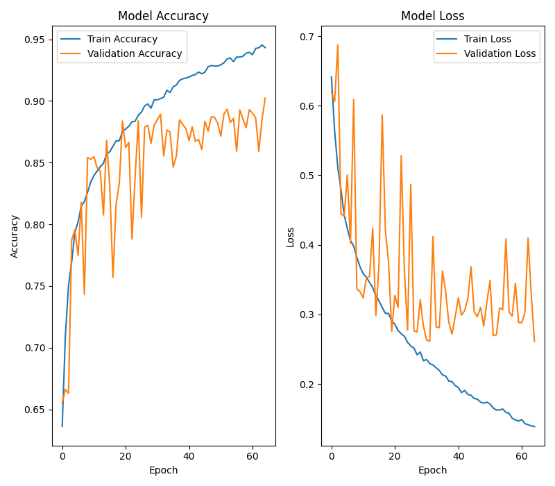
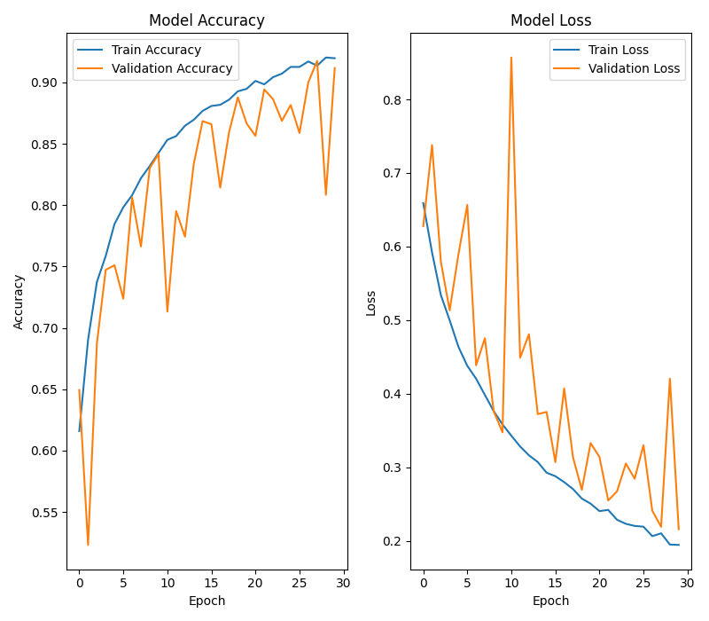
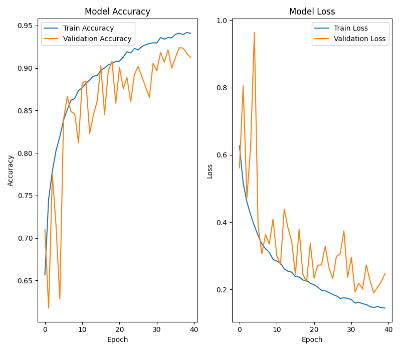
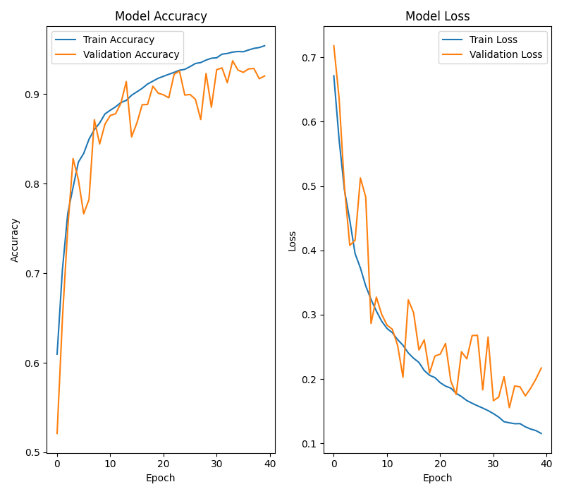

# Cats vs Dogs Image Classification with TensorFlow

A TensorFlow notebook project that prepares the `cats_vs_dogs` dataset for binary image classification. The current notebook focuses on dataset loading, inspection, visualization, and preprocessing. CNN model building, training, and evaluation are the next steps and are not yet implemented.

## Preview


If the preview image is unavailable, add `cat_and_dog_images_test.png` to the project root and refresh the README preview.

## Project Status

- [x] Load `cats_vs_dogs` from TensorFlow Datasets
- [x] Split the data into 80% training and 20% validation
- [x] Inspect metadata and dataset structure
- [x] Visualize raw samples with Matplotlib
- [x] Build a `tf.data` preprocessing pipeline
- [x] Define a CNN architecture
- [x] Train the model
- [x] Evaluate model performance
- [x] Tune hyperparameters and improve accuracy

## Dataset

This notebook uses **TensorFlow Datasets** `cats_vs_dogs/4.0.1`.

- Labels: `0 = Cat`, `1 = Dog`
- Usable images: `23,262`
- Corrupted images excluded during dataset preparation: `1,738`
- Split used in the notebook: `80%` training, `20%` validation

## Requirements

Install the core dependencies:

```bash
pip install tensorflow tensorflow-datasets matplotlib
```

The notebook itself relies on TensorFlow, TensorFlow Datasets, and Matplotlib. If you run into environment issues, see the troubleshooting section for `protobuf` and `importlib-resources`.

## Quick Start

### Load the dataset

```python
import tensorflow_datasets as tfds

(train_ds, val_ds), ds_info = tfds.load(
    "cats_vs_dogs",
    split=["train[:80%]", "train[80%:]"],
    with_info=True,
    as_supervised=True,
)

print(ds_info)
```

### Preprocess and build the pipeline

```python
import tensorflow as tf


def preprocess(image, label):
    image = tf.image.resize(image, (32, 32))
    image = tf.cast(image, tf.float32) / 255.0
    return image, label

train_data = (
    train_normal
    .shuffle(1000)
    .batch(32)
    .prefetch(tf.data.AUTOTUNE))

validation_data = (
    validation_normal
    .batch(32)
    .prefetch(tf.data.AUTOTUNE))

```

### Visualize samples

```python
import matplotlib.pyplot as plt

plt.figure(figsize=(10, 10))
for i, (image, label) in enumerate(train_ds.take(12)):
    plt.subplot(3, 4, i + 1)
    plt.imshow(image)
    plt.title('Dogs' if label.numpy() == 1 else 'Cats')
    plt.axis('off');

plt.tight_layout()
plt.savefig('cat_and_dog_images_test')
plt.show()
```
## Data Augmentation Strategy

To improve model generalization and reduce overfitting, I have implemented an integrated **Data Augmentation** strategy. Instead of using legacy external generators, these transformations are built directly into the Keras model as layers.

### Implementation

The augmentation pipeline is defined as a `Sequential` layer that processes training data before it enters the convolutional blocks:
```python
data_augmentation = keras.Sequential([
layers.RandomFlip("horizontal"),
layers.RandomRotation(0.1),
layers.RandomZoom(0.1),
layers.RandomContrast(0.1),
], name="data_augmentation")
```

## Model Architecture

The classification model is built using a deep Convolutional Neural Network (CNN) following modern architectural best practices (VGG-style blocks combined with Batch Normalization, Dropout regularization, and Global Average Pooling).
```python
model = Sequential([
data_augmentation,

# Block 1 (64 filters)
Conv2D(64, (3, 3), padding='same'),
BatchNormalization(),
Activation('relu'),
Conv2D(64, (3, 3), padding='same'),
BatchNormalization(),
Activation('relu'),
MaxPooling2D((2, 2)),
Dropout(0.1),

# Block 2 (128 filters)
Conv2D(128, (3, 3), padding='same'),
BatchNormalization(),
Activation('relu'),
Conv2D(128, (3, 3), padding='same'),
BatchNormalization(),
Activation('relu'),
MaxPooling2D((2, 2)),
Dropout(0.15),

# Block 3 (256 filters)
Conv2D(256, (3, 3), padding='same'),
BatchNormalization(),
Activation('relu'),
Conv2D(256, (3, 3), padding='same'),
BatchNormalization(),
Activation('relu'),
MaxPooling2D((2, 2)),
Dropout(0.15),

# Classification Head
GlobalAveragePooling2D(),
Dense(256, activation='relu'),
Dropout(0.2),
Dense(1, activation='sigmoid')
])
```
Architectural Highlights
* **VGG-Style Convolutional Blocks: Successive** 
3×3
 convolutions with increasing filter depth (
64
→
128
→
256
64→128→256
) allow the network to extract both low-level patterns (edges, textures) and complex semantic features (ears, whiskers, snouts).
* **Batch Normalization**: Applied after every convolutional layer to stabilize and accelerate convergence while mitigating internal covariate shift.
* **Progressive Regularization**: Increasing Dropout rates (
0.10
→
0.15
→
0.20
0.10→0.15→0.20
) prevent co-adaptation of features across deeper layers.
* **Global Average Pooling (GAP)**: Replaces traditional heavy Flatten layers to drastically reduce trainable parameters, minimize overfitting, and make the model robust to spatial translations.
Binary Output Head: A single unit with a sigmoid activation function suited for binary cross-entropy optimization (0: Cat, 1: Dog).

## Model Compilation

The network is compiled for binary classification using the **Adam** optimizer, **Binary Crossentropy** loss function, and tracking **Accuracy** metric:
```python
model.compile(
optimizer='adam',
loss='binary_crossentropy',
metrics=['accuracy']
)
```
### Configuration Details

- **Loss Function (`binary_crossentropy`):** Paired with the single sigmoid output neuron, this computes the cross-entropy metric between the true binary labels and predicted probabilities:

  $$\mathcal{L} = -\frac{1}{N} \sum_{i=1}^N \Big[ y_i \log(\hat{y}_i) + (1 - y_i) \log(1 - \hat{y}_i) \Big]$$

- **Optimizer (`Adam`):** Combines AdaGrad and RMSProp advantages, utilizing adaptive learning rates with momentum for stable gradient updates across deep convolutional layers.
- **Metric (`accuracy`):** Tracks the ratio of correctly classified cat and dog samples per batch and epoch.

## Model Training

The CNN is trained across 60 epochs using an end-to-end pipeline with real-time validation tracking:
```python
his = model.fit(
train_data,
epochs=60,
validation_data=validation_data
)
```
### Training Configuration:
* **Epochs:** `60`
* **Batch Size:** `32` (configured in data pipeline)
* **Optimization Target:** Minimizing `binary_crossentropy` while maximizing validation accuracy.
* **History Tracker:** The training dynamics (loss & accuracy curves across epochs) are stored in the `his` history object for downstream evaluation and diagnostic plotting.

## 📊 Model Evaluation & Results

The model was evaluated on both training and validation splits in inference mode (`Dropout` and real-time `Augmentation` layers disabled):
```python
train_loss, train_acc = model.evaluate(train_data)
val_loss, val_acc = model.evaluate(validation_data)
```
### 📊 Performance Summary

| Split | Samples | Loss | Accuracy | Performance Note |
| :--- | :---: | :---: | :---: | :--- |
| 🏋️ **Training Set** | 18,610 (80%) | `0.11` | **96.15%%** | High convergence & feature capture |
| 🧪 **Validation Set** | 4,652 (20%) | `0.26` | **90.37%** | Strong generalization with low error gap |


## Model Summary and Training Curves

After building the model, `model.summary()` is used to display the model architecture.  
It provides useful information about each layer, including output shapes and the number of trainable parameters.
```python
model.summary()
```
## Learning Curves:
The code below visualizes the training process by plotting:

* Training Accuracy
* Validation Accuracy
* Training Loss
* Validation Loss
These curves help evaluate model convergence and identify potential issues such as overfitting or underfitting.

## Training and Validation Curves

The following plot shows the model's training and validation accuracy and loss across all epochs.

<p align="center">
  
</p>

## 🚀 Model Optimization & Refinement (Version 2)

To capture richer visual patterns and achieve a tighter generalization gap, several architectural and pipeline enhancements were introduced:

### 1. Updated Pipeline & Higher Resolution
- **Resolution Increase:** Increased input image resolution from $32\times32$ to $64\times64$, preserving finer structural details (edges, whiskers, and fur textures).
- **Shuffle Buffer Tuning:** Expanded training shuffle buffer size to `1,500` for better data stochasticity.
```python
def preprocessing_image(image, label):
image = tf.image.resize(image, (64, 64))
image = tf.cast(image, tf.float32) / 255.0
return image, label

train_data = (
train_normal
.shuffle(1500)
.batch(32)
.prefetch(tf.data.AUTOTUNE)
)

validation_data = (
validation_normal
.batch(32)
.prefetch(tf.data.AUTOTUNE)
)
```
2. Enhanced Model Architecture
The network head was upgraded to a two-tier dense structure (Dense(256) followed by Dense(128)) with progressive dropout regularization up to 0.30 to prevent over-reliance on specific feature maps:

```
model = Sequential([
data_augmentation,

# Block 1 (64 Filters)
Conv2D(64, (3, 3), padding='same'),
BatchNormalization(),
Activation('relu'),
Conv2D(64, (3, 3), padding='same'),
BatchNormalization(),
Activation('relu'),
MaxPooling2D((2, 2)),
Dropout(0.1),

# Block 2 (128 Filters)
Conv2D(128, (3, 3), padding='same'),
BatchNormalization(),
Activation('relu'),
Conv2D(128, (3, 3), padding='same'),
BatchNormalization(),
Activation('relu'),
MaxPooling2D((2, 2)),
Dropout(0.15),

# Block 3 (256 Filters)
Conv2D(256, (3, 3), padding='same'),
BatchNormalization(),
Activation('relu'),
Conv2D(256, (3, 3), padding='same'),
BatchNormalization(),
Activation('relu'),
MaxPooling2D((2, 2)),
Dropout(0.2),

# Classification Head (Global Average Pooling + Multi-Dense)
GlobalAveragePooling2D(),
Dense(256, activation='relu'),
Dropout(0.2),
Dense(128, activation='relu'),
Dropout(0.3),
Dense(1, activation='sigmoid')
])

```
3. Training & Optimization Settings
* Optimizer: RMSprop (
learning_rate
=
0.001
learning_rate=0.001
) for adaptive gradient step-sizing.
* Loss: binary_crossentropy
* Epochs: 30

```
model.compile(
loss=tf.keras.losses.binary_crossentropy,
optimizer=tf.keras.optimizers.RMSprop(learning_rate=0.001),
metrics=['acc']
)
his = model.fit(
train_data,
epochs=30,
validation_data=validation_data
)
```

4. 📊 Evaluation & Comparative Results
By refining the architecture and using RMSprop over 30 epochs, the model shows significantly reduced variance and overfitting, closing the train-val gap to just 
∼
1.5
%
∼1.5%
:
### 📊 Performance Summary

| Split | Samples | Loss | Accuracy | Performance Note |
| :--- | :---: | :---: | :---: | :--- |
| 🏋️ **Training Set** | 18,610 (80%) | `0.18` | **92.74%** | High convergence & feature capture |
| 🧪 **Validation Set** | 4,652 (20%) | `0.22` | **91.17%** | Strong generalization with low error gap |

<p align="center">
  
</p>

`Key Takeaway: The higher resolution (
64
×
64
64×64
) combined with multi-layer dense regularization yielded a model that generalizes significantly better on unseen test samples without overfitting.`


## 🔬 Experiment 3: Deeper 4-Block CNN Architecture & Fine-Tuned Optimization

In this experiment, the network capacity was scaled up by adding a 4th convolutional block (512 feature maps) and fine-tuning the optimizer's learning rate to capture higher-level abstract representations.

### Key Architectural Changes & Rationale
1. **Deeper Feature Extraction (4 Blocks):** Added an extra convolutional stage with `512` filters to extract fine-grained semantic features.
2. **Lower Learning Rate ($\text{lr} = 10^{-4}$):** Reduced the RMSprop learning rate from `0.001` to `0.0001` to ensure stable, smooth convergence and prevent gradient instability in deeper layers.
3. **Scaled Classification Head:** Configured `Dense(512)` with `Dropout(0.2)` right after Global Average Pooling to handle the high-dimensional feature bottleneck.

---

### Model Architecture
```python
from tensorflow.keras.models import Sequential
from tensorflow.keras.layers import Conv2D, BatchNormalization, Activation, MaxPooling2D, Dropout, GlobalAveragePooling2D, Dense
import tensorflow.keras.optimizers as opt

model = Sequential([
data_augmentation,

# Block 1 (64 Filters)
Conv2D(64, (3, 3), padding='same'),
BatchNormalization(),
Activation('relu'),
Conv2D(64, (3, 3), padding='same'),
BatchNormalization(),
Activation('relu'),
MaxPooling2D((2, 2)),
Dropout(0.1),

# Block 2 (128 Filters)
Conv2D(128, (3, 3), padding='same'),
BatchNormalization(),
Activation('relu'),
Conv2D(128, (3, 3), padding='same'),
BatchNormalization(),
Activation('relu'),
MaxPooling2D((2, 2)),
Dropout(0.15),

# Block 3 (256 Filters)
Conv2D(256, (3, 3), padding='same'),
BatchNormalization(),
Activation('relu'),
Conv2D(256, (3, 3), padding='same'),
BatchNormalization(),
Activation('relu'),
MaxPooling2D((2, 2)),
Dropout(0.2),

# Block 4 (512 Filters - New Addition)
Conv2D(512, (3, 3), padding='same'),
BatchNormalization(),
Activation('relu'),
Conv2D(512, (3, 3), padding='same'),
BatchNormalization(),
Activation('relu'),
MaxPooling2D((2, 2)),
Dropout(0.25),

# Classification Head
GlobalAveragePooling2D(),
Dense(512, activation='relu'),
Dropout(0.2),
Dense(1, activation='sigmoid')
])

model.compile(
loss=tf.keras.losses.binary_crossentropy,
optimizer=opt.RMSprop(learning_rate=0.0001),
metrics=['acc']
)

his = model.fit(
train_data,
epochs=40,
validation_data=validation_data
)
```
### 📊 Experiment 3 Benchmark Results

| Split | Samples | Loss | Accuracy | Performance Insights |
| :--- | :---: | :---: | :---: | :--- |
| 🏋️ **Training Set** | 18,610 (80%) | `0.17` | **92.98%** | Enhanced model capacity leads to higher feature fitting |
| 🧪 **Validation Set** | 4,652 (20%) | `0.25` | **91.25%** | **Peak validation accuracy**, maintaining robust classification |

<p align="center">
  
</p>
# 🐾 Cats vs Dogs Classification using Deep CNN

[](https://www.tensorflow.org/)
[](https://keras.io/)
[](https://www.python.org/)
[]()
[](LICENSE)

An end-to-end Computer Vision project implementing a deep custom Convolutional Neural Network (CNN) from scratch using **TensorFlow/Keras** to classify images of cats and dogs. Through iterative architecture refinement, progressive regularization, and data pipeline optimization, the final model achieves **92.02% validation accuracy** and a low validation loss of **0.22**.

---

## 📌 Key Highlights

- **Custom Deep Architecture:** 8 Convolutional layers organized in 4 double-conv blocks (64 to 512 filters) + Global Average Pooling.
- **Robust Regularization:** Progressive Spatial Dropout (0.1 → 0.25) combined with `BatchNormalization` after every Conv layer to stabilize activations and prevent overfitting.
- **Optimized Data Pipeline:** Fully asynchronous `tf.data` pipeline with prefetching and on-the-fly Data Augmentation layers integrated directly into the computational graph.
- **Peak Performance:** Reached **94.11% Training Accuracy** and **92.02% Validation Accuracy** across 40 epochs using `Adam` optimizer.

---

## 🏆 Final Benchmark & Results (Experiment 4)

| Split | Samples | Loss | Accuracy | Generalization Status |
| :--- | :---: | :---: | :---: | :--- |
| 🏋️ **Training Set** | 18,610 (80%) | `0.14` | **94.11%** | Strong convergence without severe overfitting |
| 🧪 **Validation Set** | 4,652 (20%) | `0.22` | **92.02%** | **Best-in-Class generalization for scratch CNN** |

> **Note:** The tight gap (~2.09%) between training and validation accuracy confirms the effectiveness of the progressive dropout and batch normalization scheme.

---

## 🏗️ Model Architecture

The model uses a modular VGG-like design with modern improvements (Batch Normalization and Global Average Pooling instead of heavy Dense layers):
Input (64x64x3)

│

├── [Data Augmentation] (Random Flip, Rotation, Zoom)

│

├── [Block 1] Conv2D (64) → BN → ReLU → Conv2D (64) → BN → ReLU → MaxPool (2x2) → Dropout(0.10)

├── [Block 2] Conv2D (128) → BN → ReLU → Conv2D (128) → BN → ReLU → MaxPool (2x2) → Dropout(0.15)

├── [Block 3] Conv2D (256) → BN → ReLU → Conv2D (256) → BN → ReLU → MaxPool (2x2) → Dropout(0.20)

├── [Block 4] Conv2D (512) → BN → ReLU → Conv2D (512) → BN → ReLU → MaxPool (2x2) → Dropout(0.25)

│

├── GlobalAveragePooling2D

├── Dense (512, ReLU) → Dropout(0.20)

└── Dense (1, Sigmoid) ──► Output (Cat: 0, Dog: 1)


---

<p align="center">
  
</p>

## 🔬 Evolution & Iterations Matrix

| Experiment | Input Size | Architecture Highlights | Optimizer | Epochs | Val Loss | Val Acc |
| :--- | :---: | :--- | :---: | :---: | :---: | :---: |
| **v1: Baseline** | 32x32 | 3 Conv Blocks (64-256) + GAP | Adam (1e-3) | 20 | 0.26 | 90.37% |
| **v2: Refinement** | 64x64 | 3 Conv Blocks + Dense(256) + Dense(128) | RMSprop (1e-3) | 25 | 0.22 | 91.17% |
| **v3: Deep Capacity** | 64x64 | 4 Conv Blocks (64-512) + GAP | RMSprop (1e-4) | 30 | 0.25 | 91.25% |
| **v4: Final Optimized** 🏆 | **64x64** | **4 Conv Blocks (64-512) + Progressive Dropout** | **Adam (1e-3)** | **40** | **0.22** | **92.02%** |

---

## 💻 Final Model Implementation
```python
import tensorflow as tf
from tensorflow.keras import Sequential
from tensorflow.keras.layers import (
Conv2D, BatchNormalization, Activation,
MaxPooling2D, Dropout, GlobalAveragePooling2D, Dense
)
from tensorflow.keras.losses import binary_crossentropy
import tensorflow.keras.optimizers as opt

# Model Definition
model = Sequential([
data_augmentation,

# Block 1
Conv2D(64, (3, 3), padding='same'),
BatchNormalization(),
Activation('relu'),
Conv2D(64, (3, 3), padding='same'),
BatchNormalization(),
Activation('relu'),
MaxPooling2D((2, 2)),
Dropout(0.1),

# Block 2
Conv2D(128, (3, 3), padding='same'),
BatchNormalization(),
Activation('relu'),
Conv2D(128, (3, 3), padding='same'),
BatchNormalization(),
Activation('relu'),
MaxPooling2D((2, 2)),
Dropout(0.15),

# Block 3
Conv2D(256, (3, 3), padding='same'),
BatchNormalization(),
Activation('relu'),
Conv2D(256, (3, 3), padding='same'),
BatchNormalization(),
Activation('relu'),
MaxPooling2D((2, 2)),
Dropout(0.2),

# Block 4
Conv2D(512, (3, 3), padding='same'),
BatchNormalization(),
Activation('relu'),
Conv2D(512, (3, 3), padding='same'),
BatchNormalization(),
Activation('relu'),
MaxPooling2D((2, 2)),
Dropout(0.25),

# Classification Head
GlobalAveragePooling2D(),
Dense(512, activation='relu'),
Dropout(0.2),
Dense(1, activation='sigmoid')
])

# Compilation
model.compile(
loss=binary_crossentropy,
optimizer=opt.Adam(learning_rate=0.001),
metrics=['acc']
)

# Training
history = model.fit(
train_data,
epochs=40,
validation_data=validation_data
)
```

## Notebook Contents

- `cats_vs_dogs_image_classification_cnn.ipynb` - notebook for loading, inspecting, visualizing, and preprocessing the dataset
- `DEPENDENCIES.md` - dependency notes for the project
- `README.md` - project overview and usage guide
  
## Next Steps

- Build a convolutional neural network for binary classification
- Train the model on the prepared dataset
- Evaluate accuracy, loss, and generalization
- Inspect misclassifications and iterate on preprocessing or architecture

## Troubleshooting

If you see import or version errors, update the relevant packages first:

```bash
pip install --upgrade protobuf importlib-resources
```

If the TensorFlow Datasets cache becomes inconsistent, clear it and reload the dataset.

**Unix/Linux:**

```bash
rm -rf ~/.keras/datasets/* ~/.tensorflow_datasets/*
```

After changing dependencies or clearing caches, restart the Python kernel or notebook runtime.

## License

License placeholder: add your preferred license here.
