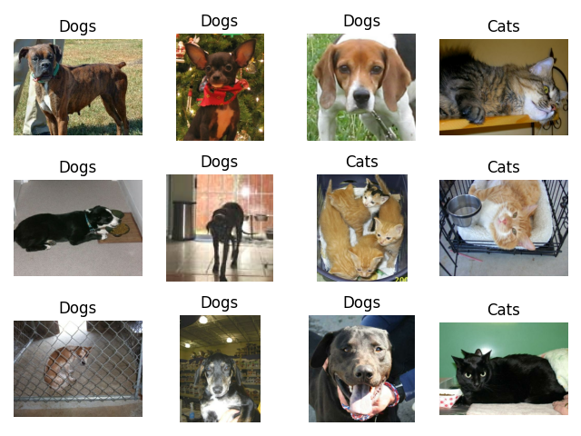

# Cats vs Dogs Image Classification with TensorFlow

A TensorFlow notebook project that prepares the `cats_vs_dogs` dataset for binary image classification. The current notebook focuses on dataset loading, inspection, visualization, and preprocessing. CNN model building, training, and evaluation are the next steps and are not yet implemented.

## Preview



If the preview image is unavailable, add `cat_and_dog_images_test.png` to the project root and refresh the README preview.

## Project Status

- [x] Load `cats_vs_dogs` from TensorFlow Datasets
- [x] Split the data into 80% training and 20% validation
- [x] Inspect metadata and dataset structure
- [x] Visualize raw samples with Matplotlib
- [x] Build a `tf.data` preprocessing pipeline
- [x] Define a CNN architecture
- [ ] Train the model
- [ ] Evaluate model performance
- [ ] Tune hyperparameters and improve accuracy

## Dataset

This notebook uses **TensorFlow Datasets** `cats_vs_dogs/4.0.1`.

- Labels: `0 = Cat`, `1 = Dog`
- Usable images: `23,262`
- Corrupted images excluded during dataset preparation: `1,738`
- Split used in the notebook: `80%` training, `20%` validation

## Requirements

Install the core dependencies:

```bash
pip install tensorflow tensorflow-datasets matplotlib
```

The notebook itself relies on TensorFlow, TensorFlow Datasets, and Matplotlib. If you run into environment issues, see the troubleshooting section for `protobuf` and `importlib-resources`.

## Quick Start

### Load the dataset

```python
import tensorflow_datasets as tfds

(train_ds, val_ds), ds_info = tfds.load(
    "cats_vs_dogs",
    split=["train[:80%]", "train[80%:]"],
    with_info=True,
    as_supervised=True,
)

print(ds_info)
```

### Preprocess and build the pipeline

```python
import tensorflow as tf


def preprocess(image, label):
    image = tf.image.resize(image, (32, 32))
    image = tf.cast(image, tf.float32) / 255.0
    return image, label

train_data = (
    train_normal
    .shuffle(1000)
    .batch(32)
    .prefetch(tf.data.AUTOTUNE))

validation_data = (
    validation_normal
    .batch(32)
    .prefetch(tf.data.AUTOTUNE))

```

### Visualize samples

```python
import matplotlib.pyplot as plt

plt.figure(figsize=(10, 10))
for i, (image, label) in enumerate(train_ds.take(12)):
    plt.subplot(3, 4, i + 1)
    plt.imshow(image)
    plt.title('Dogs' if label.numpy() == 1 else 'Cats')
    plt.axis('off');

plt.tight_layout()
plt.savefig('cat_and_dog_images_test')
plt.show()
```
## Data Augmentation Strategy

To improve model generalization and reduce overfitting, I have implemented an integrated **Data Augmentation** strategy. Instead of using legacy external generators, these transformations are built directly into the Keras model as layers.

### Implementation

The augmentation pipeline is defined as a `Sequential` layer that processes training data before it enters the convolutional blocks:
```python
data_augmentation = keras.Sequential([
layers.RandomFlip("horizontal"),
layers.RandomRotation(0.1),
layers.RandomZoom(0.1),
layers.RandomContrast(0.1),
], name="data_augmentation")
```

## Model Architecture

The classification model is built using a deep Convolutional Neural Network (CNN) following modern architectural best practices (VGG-style blocks combined with Batch Normalization, Dropout regularization, and Global Average Pooling).
```python
model = Sequential([
data_augmentation,

# Block 1 (64 filters)
Conv2D(64, (3, 3), padding='same'),
BatchNormalization(),
Activation('relu'),
Conv2D(64, (3, 3), padding='same'),
BatchNormalization(),
Activation('relu'),
MaxPooling2D((2, 2)),
Dropout(0.1),

# Block 2 (128 filters)
Conv2D(128, (3, 3), padding='same'),
BatchNormalization(),
Activation('relu'),
Conv2D(128, (3, 3), padding='same'),
BatchNormalization(),
Activation('relu'),
MaxPooling2D((2, 2)),
Dropout(0.15),

# Block 3 (256 filters)
Conv2D(256, (3, 3), padding='same'),
BatchNormalization(),
Activation('relu'),
Conv2D(256, (3, 3), padding='same'),
BatchNormalization(),
Activation('relu'),
MaxPooling2D((2, 2)),
Dropout(0.15),

# Classification Head
GlobalAveragePooling2D(),
Dense(256, activation='relu'),
Dropout(0.2),
Dense(1, activation='sigmoid')
])
```
Architectural Highlights
* **VGG-Style Convolutional Blocks: Successive** 
3
×
3
3×3
 convolutions with increasing filter depth (
64
→
128
→
256
64→128→256
) allow the network to extract both low-level patterns (edges, textures) and complex semantic features (ears, whiskers, snouts).
* **Batch Normalization**: Applied after every convolutional layer to stabilize and accelerate convergence while mitigating internal covariate shift.
* **Progressive Regularization**: Increasing Dropout rates (
0.10
→
0.15
→
0.20
0.10→0.15→0.20
) prevent co-adaptation of features across deeper layers.
* **Global Average Pooling (GAP)**: Replaces traditional heavy Flatten layers to drastically reduce trainable parameters, minimize overfitting, and make the model robust to spatial translations.
Binary Output Head: A single unit with a sigmoid activation function suited for binary cross-entropy optimization (0: Cat, 1: Dog).

## Notebook Contents

- `cats_vs_dogs_image_classification_cnn.ipynb` - notebook for loading, inspecting, visualizing, and preprocessing the dataset
- `DEPENDENCIES.md` - dependency notes for the project
- `README.md` - project overview and usage guide

## Next Steps

- Build a convolutional neural network for binary classification
- Train the model on the prepared dataset
- Evaluate accuracy, loss, and generalization
- Inspect misclassifications and iterate on preprocessing or architecture

## Troubleshooting

If you see import or version errors, update the relevant packages first:

```bash
pip install --upgrade protobuf importlib-resources
```

If the TensorFlow Datasets cache becomes inconsistent, clear it and reload the dataset.

**Unix/Linux:**

```bash
rm -rf ~/.keras/datasets/* ~/.tensorflow_datasets/*
```

After changing dependencies or clearing caches, restart the Python kernel or notebook runtime.

## License

License placeholder: add your preferred license here.
